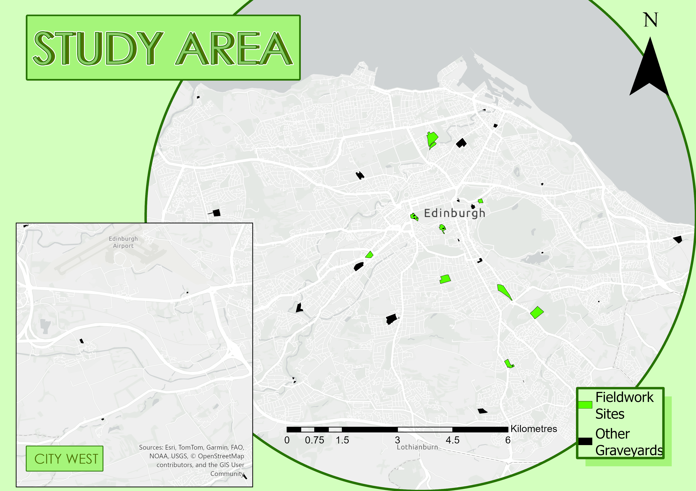

# 🌳 Edinburgh Graveyard Carbon Intelligence

> Interactive visualization platform for carbon storage and environmental deprivation research in Edinburgh graveyards

[](https://python.org)
[](https://flask.palletsprojects.com)
[](https://oracle.com)
[](#)

---

# 📖 English Version (Detailed Beginner Guide)

## 🎯 What is this project?

This is an **interactive web map application** that displays:
- 🌲 **Carbon storage capacity** of Edinburgh's 35 graveyards
- 📊 **Environmental quality scores** (EDI index) for each graveyard
- 🏘️ **Socioeconomic conditions** (SIMD index) of surrounding areas
- 🗺️ All data visualized on an **interactive map**

**Why study graveyards?** Because graveyards typically have many old trees, making them important "green lungs" and carbon sinks in urban areas!

## 🌱 Why Graveyards?

Edinburgh's graveyards bring many benefits to tourism, biodiversity, and wellbeing. But what about their role in carbon storage?

- Since declaring a climate emergency in 2019, Edinburgh Council now admits it may not reach its target of net zero by 2030. The council's climate plan urges the city to "sequester carbon where possible."
- A recent study found London's urban parks and graveyards can store as much carbon as temperate and tropical forests. Can Edinburgh's cemeteries do the same?
- To find out, we measured above-ground carbon in 35 graveyards. We used this data to measure environmental and social deprivation, identifying priority greenspaces for restoration, protection, and enhancement.

## 🗺️ Study Area

Our study focuses on 35 graveyards across Edinburgh, selected for their size, tree coverage, and distribution across different socioeconomic areas. These green spaces represent a significant yet understudied component of the city's urban forest.


*Figure 1: Map showing the distribution of the 35 studied graveyards across Edinburgh, overlaid with SIMD (Scottish Index of Multiple Deprivation) data. The size of each circle represents the relative carbon storage capacity of each site.*

---

## 🛠️ Tech Stack Explained

| Technology | What is it? | What does it do here? |
|------------|-------------|----------------------|
| **Python** | Programming language | Writes backend code, processes data |
| **Flask** | Python web framework | Makes Python respond to web requests |
| **Oracle Database** | Enterprise database | Stores all data for 35 graveyards |
| **HTML/CSS/JS** | Web technologies | Builds the user interface |
| **Leaflet.js** | Map library | Displays interactive map on webpage |
| **GeoJSON** | Geographic data format | Stores graveyard boundary coordinates |

---

## 📁 Project File Structure

```
deploy-web-2/
│
├── 📄 app.py                    # ⭐ Main program! Flask backend
│
├── 📁 web/                      # Web template folder (renamed from templates)
│   └── 📄 map.html              # ⭐ Frontend page! Map + Report
│
├── 📁 data/
│   ├── 📄 Cemeteries_35.json    # Geographic boundaries (GeoJSON)
│   └── 📄 edinburgh_simd.json   # SIMD deprivation data
│
├── 📁 static/
│   └── 📁 report_images/        # Report images
│
├── 📄 01_create_tables_clean.sql   # SQL: Create database table
├── 📄 02_insert_data.sql           # SQL: Insert graveyard data
├── 📄 update_edi_values.sql        # SQL: Update EDI values
│
└── 📄 README.md                 # This document
```

---

## 🗃️ Database Table Structure

### `graveyards` Table

| Field | Type | Description | Example |
|-------|------|-------------|---------|
| `id` | NUMBER | Primary key | 1, 2, 3... |
| `name` | VARCHAR2(100) | Graveyard name | "Grange Cemetery" |
| `area_m2` | NUMBER | Area in m² | 45000.5 |
| `area_hectares` | NUMBER | Area in hectares | 4.5 |
| `ndvi_mean` | NUMBER | NDVI index (0-1) | 0.65 |
| `carbon_per_hectare_calibrate` | NUMBER | Carbon per hectare (tonnes) | 125.8 |
| `edi_norm` | NUMBER | EDI index (0-1 normalized) | 0.72 |
| `simd_decile` | NUMBER | SIMD decile (1-10) | 7 |
| `canopy_percentage` | NUMBER | Canopy cover (%) | 45.2 |
| `carbon_total_tonnes` | NUMBER | Total carbon (tonnes) | 566.1 |

### Key Metrics Explained

#### 🌿 NDVI (Normalized Difference Vegetation Index)
- **Range**: 0 to 1
- **Meaning**: Measures vegetation health
- **Interpretation**:
  - 0.0-0.2 = Almost no vegetation
  - 0.2-0.4 = Sparse vegetation
  - 0.4-0.6 = Moderate vegetation
  - 0.6-1.0 = Dense, healthy vegetation ✅

#### 🌍 EDI (Environmental Deprivation Index)
- **Range**: 0 to 1 (normalized)
- **Meaning**: Overall environmental quality
- **Interpretation**:
  - Close to 0 = Poor environment (most deprived) ❌
  - Close to 1 = Good environment (least deprived) ✅

#### 🏘️ SIMD (Scottish Index of Multiple Deprivation)
- **Range**: 1 to 10
- **Meaning**: Socioeconomic deprivation level
- **Interpretation**:
  - 1-2 = Most deprived (poorer areas) ❌
  - 9-10 = Least deprived (wealthier areas) ✅

#### 🌳 Carbon Calculation
```
Total Carbon (tonnes) = Carbon/ha × Area(m²) ÷ 10000
```

---

## 🚀 Running the Project (Step-by-Step)

### Step 1: Install Python
- Download: https://python.org/downloads/
- ⚠️ Check "Add Python to PATH" during installation!

### Step 2: Install Dependencies
```bash
pip install flask oracledb
```

### Step 3: Start the Server
```bash
cd d:\网页测试\deploy-web-2
python app.py
```

You'll see:
```
=== Oracle Database Login ===
Username: [enter your username]
Password: [enter password, hidden]
Credentials set successfully!

 * Running on http://localhost:55429
```

### Step 4: Open in Browser
```
http://localhost:55429
```

🎉 **Done! You should see the interactive map!**

---

## 📊 Visualization Modes

| Mode | Data Source | Color Scheme |
|------|-------------|--------------|
| **Carbon** | carbon_per_hectare_calibrate | Green gradient |
| **EDI** | edi_norm (0-1) | Blue-Cyan-Green-Yellow |
| **SIMD** | simd_decile (1-10) | Yellow-Orange gradient |
| **NDVI** | ndvi_mean | Green gradient |
| **Canopy** | canopy_percentage | Green gradient |

---

## 👥 Development Team

**University of Edinburgh - School of GeoSciences - MSc GIS 2025**

| Member | Role |
|--------|------|
| Alex Shaw | Team Member |
| Charlotte Thomson | Team Member |
| Lama Alqahtani | Team Member |
| Ollie Cavill | Team Member |
| Wu Xinxin | Team Member |
| Xiao Lang | Team Member |

---

## 📜 License

This project is for academic research purposes only.

---
---
---

# 📖 中文版本（超详细小白教程）

## 🎯 这个项目是做什么的？

简单来说，这是一个**交互式网页地图应用**，用来展示：
- 🌲 爱丁堡35个墓地的**碳储存能力**（树木吸收了多少二氧化碳）
- 📊 每个墓地的**环境质量评分**（EDI指数）
- 🏘️ 墓地所在区域的**社会经济状况**（SIMD指数）
- 🗺️ 所有数据在**交互式地图**上的可视化展示

**为什么研究墓地？** 因为墓地通常有很多老树，是城市中重要的"绿肺"和碳汇！

---

## 🛠️ 技术栈详解（给新手的解释）

| 技术 | 是什么 | 在项目中做什么 |
|------|--------|----------------|
| **Python** | 编程语言 | 写后端代码，处理数据 |
| **Flask** | Python网页框架 | 让Python代码能响应网页请求 |
| **Oracle Database** | 企业级数据库 | 存储35个墓地的所有数据 |
| **HTML/CSS/JS** | 网页三剑客 | 构建用户看到的网页界面 |
| **Leaflet.js** | 地图库 | 在网页上显示交互式地图 |
| **GeoJSON** | 地理数据格式 | 存储墓地的地理边界坐标 |

---

## 📁 项目文件结构（每个文件是干嘛的）

```
deploy-web-2/
│
├── 📄 app.py                    # ⭐ 主程序！Flask后端，连接数据库，提供API
│
├── 📁 web/                      # 网页模板文件夹（已从templates重命名）
│   └── 📄 map.html              # ⭐ 前端页面！地图+报告都在这里
│
├── 📁 data/                     # 数据文件夹
│   ├── 📄 Cemeteries_35.json    # 35个墓地的地理边界（GeoJSON格式）
│   └── 📄 edinburgh_simd.json   # 爱丁堡SIMD社会剥夺数据
│
├── 📁 static/                   # 静态资源文件夹
│   └── 📁 report_images/        # 报告中用到的图片
│
├── 📄 01_create_tables_clean.sql   # SQL脚本：创建数据库表
├── 📄 02_insert_data.sql           # SQL脚本：插入墓地数据
├── 📄 update_edi_values.sql        # SQL脚本：更新EDI值
│
└── 📄 README.md                 # 你正在看的这个文档
```

---

## 🗃️ 数据库表结构详解

### `graveyards` 表（墓地数据表）

这个表存储了35个墓地的所有信息：

| 字段名 | 数据类型 | 说明 | 示例值 |
|--------|----------|------|--------|
| `id` | NUMBER | 主键，自动编号 | 1, 2, 3... |
| `name` | VARCHAR2(100) | 墓地名称 | "Grange Cemetery" |
| `area_m2` | NUMBER | 面积（平方米） | 45000.5 |
| `area_hectares` | NUMBER | 面积（公顷）= 平方米/10000 | 4.5 |
| `ndvi_mean` | NUMBER | NDVI植被指数（0-1） | 0.65 |
| `carbon_per_hectare_calibrate` | NUMBER | 每公顷碳储量（吨） | 125.8 |
| `edi_norm` | NUMBER | EDI环境指数（0-1标准化） | 0.72 |
| `simd_decile` | NUMBER | SIMD社会剥夺等级（1-10） | 7 |
| `canopy_percentage` | NUMBER | 树冠覆盖率（%） | 45.2 |
| `carbon_total_tonnes` | NUMBER | 碳储量总量（吨） | 566.1 |

### 关键指标解释

#### 🌿 NDVI（归一化植被指数）
- **范围**：0 到 1
- **含义**：衡量植被健康程度
- **解读**：
  - 0.0-0.2 = 几乎没有植被（水面、建筑）
  - 0.2-0.4 = 稀疏植被
  - 0.4-0.6 = 中等植被
  - 0.6-1.0 = 茂密健康植被 ✅

#### 🌍 EDI（环境剥夺指数）
- **范围**：0 到 1（已标准化）
- **含义**：综合评估环境质量
- **解读**：
  - 接近 0 = 环境质量差（最剥夺）❌
  - 接近 1 = 环境质量好（最不剥夺）✅
- **计算公式**：结合了碳储量、树冠覆盖、NDVI等多个因素

#### 🏘️ SIMD（苏格兰多重剥夺指数）
- **范围**：1 到 10
- **含义**：衡量社会经济剥夺程度
- **解读**：
  - 1-2 = 最剥夺（贫困地区）❌
  - 3-4 = 较剥夺
  - 5-6 = 中等
  - 7-8 = 较富裕
  - 9-10 = 最不剥夺（富裕地区）✅

#### 🌳 碳储量计算
```
总碳储量(吨) = 每公顷碳储量(吨/公顷) × 面积(平方米) ÷ 10000
```
**示例**：一个墓地每公顷储存125吨碳，面积4公顷
```
总碳储量 = 125 × 40000 ÷ 10000 = 500 吨
```

---

## 🔧 后端代码详解 (app.py)

### 程序启动流程

```
┌─────────────────────────────────────────────────────────┐
│  1. 启动 python app.py                                   │
├─────────────────────────────────────────────────────────┤
│  2. 提示输入数据库用户名和密码（安全模式）                │
├─────────────────────────────────────────────────────────┤
│  3. Flask 服务器启动，监听 localhost:55429              │
├─────────────────────────────────────────────────────────┤
│  4. 用户访问网页 → 触发路由 → 返回数据                   │
└─────────────────────────────────────────────────────────┘
```

### 核心函数解释

#### `fetch_enriched_data()` - 数据获取与融合

这个函数做了以下事情：

```python
def fetch_enriched_data():
    # 步骤1: 读取GeoJSON文件（墓地地理边界）
    with open('data/Cemeteries_35.json') as f:
        geojson_data = json.load(f)
    
    # 步骤2: 连接Oracle数据库
    conn = oracledb.connect(user=..., password=..., dsn=...)
    
    # 步骤3: 查询墓地数据
    cur.execute("""
        SELECT name, area_m2, carbon_per_hectare_calibrate, 
               edi_norm, simd_decile, ...
        FROM graveyards
    """)
    
    # 步骤4: 将数据库数据与GeoJSON合并
    for feature in geojson_data['features']:
        # 按名称匹配，把数据库的数据加到GeoJSON里
        feature['properties']['CarbonPerHectare'] = ...
        feature['properties']['EDI'] = ...
    
    # 步骤5: 返回合并后的数据
    return geojson_data
```

### API 路由说明

| 路由 | 请求方式 | 返回内容 | 用途 |
|------|----------|----------|------|
| `/` | GET | HTML页面 | 显示主页面（地图+报告） |
| `/api/graveyards` | GET | JSON数据 | 前端获取墓地数据用于渲染地图 |
| `/api/simd` | GET | JSON数据 | 前端获取SIMD背景图层数据 |

---

## 🎨 前端代码详解 (map.html)

### 页面结构

```
┌─────────────────────────────────────────────────────────┐
│                     导航栏                               │
│  [Logo] [Home] [Report] [Map]                           │
├─────────────────────────────────────────────────────────┤
│                                                         │
│  ┌─────────┐  ┌───────────────────────────────────┐    │
│  │         │  │                                   │    │
│  │  侧边栏  │  │          地图区域                 │    │
│  │         │  │                                   │    │
│  │ - 搜索   │  │    [Leaflet交互式地图]            │    │
│  │ - 统计   │  │                                   │    │
│  │ - 列表   │  │                                   │    │
│  │         │  │                                   │    │
│  └─────────┘  └───────────────────────────────────┘    │
│                                                         │
└─────────────────────────────────────────────────────────┘
```

### 关键JavaScript函数

#### 1. 地图初始化
```javascript
var map = L.map('map').setView([55.9533, -3.1883], 12);
// 创建地图，中心点在爱丁堡，缩放级别12
```

#### 2. 数据获取
```javascript
fetch('/api/graveyards')
    .then(response => response.json())
    .then(data => {
        // 用获取的数据渲染地图
        renderMap(data);
    });
```

#### 3. 颜色映射（根据数据值显示不同颜色）
```javascript
function getColor(value, mode) {
    if (mode === 'carbon') {
        // 碳储量：绿色渐变
        if (value >= 200) return '#14532d';  // 深绿 - 高碳储量
        if (value >= 150) return '#166534';
        if (value >= 100) return '#22c55e';
        return '#86efac';  // 浅绿 - 低碳储量
    }
    if (mode === 'edi') {
        // EDI指数：蓝-青-绿-黄
        if (value >= 0.6) return '#1e3a5f';  // 深蓝 - 环境最好
        if (value >= 0.4) return '#0891b2';  // 青色
        if (value >= 0.25) return '#34d399'; // 绿色
        return '#fbbf24';  // 黄色 - 环境最差
    }
    // ... 其他模式
}
```

#### 4. 视图模式切换
```javascript
function setMode(mode) {
    currentMode = mode;  // 'carbon', 'edi', 'simd', 'ndvi', 'canopy'
    updateMapColors();   // 重新着色
    updateLegend();      // 更新图例
    renderList();        // 更新列表
}
```

---

## 🚀 运行项目（手把手教程）

### 第一步：安装必要软件

#### 1.1 安装 Python
- 下载地址：https://python.org/downloads/
- 安装时勾选 "Add Python to PATH" ⚠️很重要！

#### 1.2 验证安装
打开命令行（Windows按 `Win+R`，输入 `cmd`）：
```bash
python --version
# 应该显示 Python 3.8.x 或更高版本
```

### 第二步：安装项目依赖

在命令行中运行：
```bash
pip install flask oracledb
```

**如果报错**，尝试：
```bash
pip install flask oracledb -i https://pypi.tuna.tsinghua.edu.cn/simple
```

### 第三步：确保数据库可访问

项目使用的是爱丁堡大学的Oracle数据库：
- **地址**：172.16.108.21:1842
- **服务名**：GLRNLIVE_PRMY.is.ed.ac.uk
- **需要**：VPN连接到大学网络

### 第四步：启动项目

```bash
cd d:\网页测试\deploy-web-2
python app.py
```

你会看到：
```
=== Oracle Database Login ===
Username: 输入你的用户名（如 s2835812）
Password: 输入你的密码（不会显示）
Credentials set successfully!

 * Running on http://localhost:55429
```

### 第五步：访问网页

打开浏览器，访问：
```
http://localhost:55429
```

🎉 **完成！你应该能看到漂亮的地图了！**

---

## ❓ 常见问题解答

### Q1: 报错 "No module named 'flask'"
**解决**：运行 `pip install flask`

### Q2: 报错 "No module named 'oracledb'"
**解决**：运行 `pip install oracledb`

### Q3: 数据库连接失败
**可能原因**：
- 没有连接大学VPN
- 用户名或密码错误
- 数据库服务暂时不可用

### Q4: 地图上没有数据
**可能原因**：
- 数据库连接失败（查看终端错误信息）
- GeoJSON文件路径错误

### Q5: 网页打不开
**确认**：
- 终端显示 "Running on http://localhost:55429"
- 浏览器访问的地址正确

---

## 📊 数据可视化模式详解

### 模式1：碳储量 (Carbon)
- **数据来源**：`carbon_per_hectare_calibrate`
- **颜色方案**：绿色渐变（深绿=高碳储量）
- **图例**：
  - 🟢 深绿：≥200 吨/公顷
  - 🟢 中绿：150-200 吨/公顷
  - 🟢 浅绿：100-150 吨/公顷
  - 🟢 最浅：<100 吨/公顷

### 模式2：环境剥夺指数 (EDI)
- **数据来源**：`edi_norm`（0-1标准化）
- **颜色方案**：蓝-青-绿-黄
- **图例**：
  - 🔵 深蓝：≥0.6（环境最好）
  - 🔵 青色：0.4-0.6
  - 🟢 绿色：0.25-0.4
  - 🟡 黄色：<0.25（环境最差）

### 模式3：社会剥夺指数 (SIMD)
- **数据来源**：`simd_decile`（1-10）
- **颜色方案**：黄-橙渐变
- **图例**：
  - 🟡 浅黄：9-10（最不剥夺/富裕）
  - 🟡 黄色：7-8
  - 🟠 淡橙：5-6
  - 🟠 橙色：3-4
  - 🟠 深橙：1-2（最剥夺/贫困）

---

## 🏗️ 项目架构图

```
┌──────────────────────────────────────────────────────────────┐
│                        用户浏览器                             │
│                    (Chrome/Firefox/Edge)                     │
└────────────────────────────┬─────────────────────────────────┘
                             │ HTTP请求
                             ▼
┌──────────────────────────────────────────────────────────────┐
│                      Flask Web服务器                          │
│                       (app.py)                               │
│  ┌─────────────┐  ┌─────────────┐  ┌─────────────────────┐  │
│  │ 路由处理    │  │ 数据融合    │  │ API端点             │  │
│  │ /          │  │ GeoJSON +   │  │ /api/graveyards    │  │
│  │ /api/...   │  │ Database    │  │ /api/simd          │  │
│  └─────────────┘  └─────────────┘  └─────────────────────┘  │
└────────────────────────────┬─────────────────────────────────┘
                             │ SQL查询
                             ▼
┌──────────────────────────────────────────────────────────────┐
│                     Oracle Database                          │
│                  (爱丁堡大学服务器)                           │
│  ┌─────────────────────────────────────────────────────┐    │
│  │ graveyards 表                                        │    │
│  │ - 35条墓地记录                                       │    │
│  │ - 碳储量、EDI、SIMD等数据                            │    │
│  └─────────────────────────────────────────────────────┘    │
└──────────────────────────────────────────────────────────────┘
```

---

## 📝 代码修改指南

### 如何添加新的数据字段？

#### 步骤1：在数据库添加字段
```sql
ALTER TABLE graveyards ADD new_field NUMBER;
```

#### 步骤2：在 app.py 中查询新字段
```python
cur.execute("""
    SELECT name, ..., new_field
    FROM graveyards
""")
```

#### 步骤3：在数据字典中添加
```python
db_data[name] = {
    ...
    'NewField': row[X] or 0,
}
```

#### 步骤4：在前端 map.html 中使用
```javascript
var newValue = feature.properties.NewField;
```

---

## 🎓 学习资源

- **Flask官方教程**：https://flask.palletsprojects.com/
- **Leaflet官方文档**：https://leafletjs.com/reference.html
- **GeoJSON规范**：https://geojson.org/
- **Oracle SQL教程**：https://docs.oracle.com/en/database/

---

## 👥 开发团队

**爱丁堡大学 - 地理科学学院 - MSc GIS 2025**

| 成员 | 职责 |
|------|------|
| Alex Shaw | 团队成员 |
| Charlotte Thomson | 团队成员 |
| Lama Alqahtani | 团队成员 |
| Ollie Cavill | 团队成员 |
| Wu Xinxin | 团队成员 |
| Xiao Lang | 团队成员 |

---

## 📜 许可证

本项目仅用于学术研究目的。
